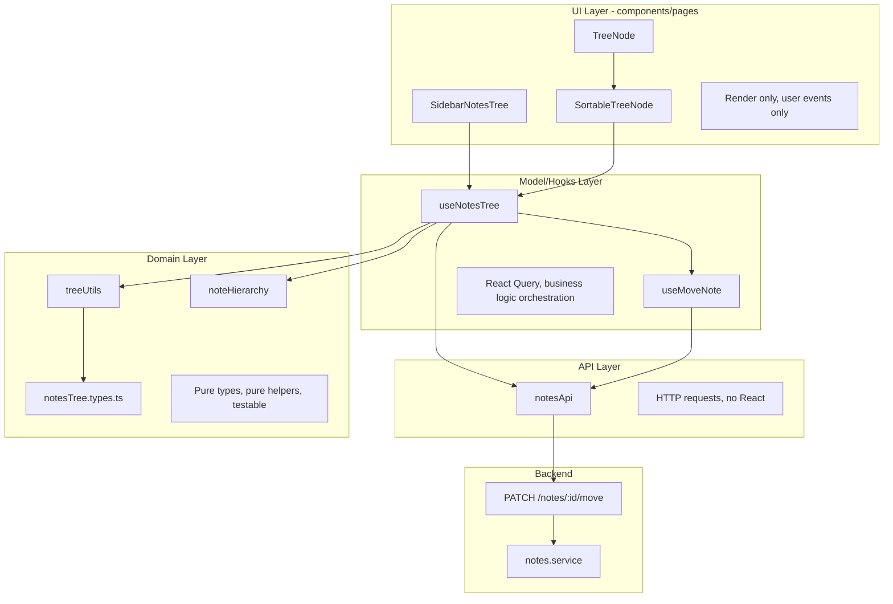

# Tree Drag & Drop — Architecture Overview & File Plan

## 1. ARCHITECTURE OVERVIEW

### Layers and Responsibilities

### Layer Rules

| Layer | Responsibility | Forbidden |
|-------|----------------|-----------|
| **UI** | Render, handle user events, call hooks for data/actions | API calls, DTOs, validation, business logic, mapping |
| **Model/Hooks** | React Query, orchestrate business flows, expose callbacks | Direct DOM manipulation |
| **API** | HTTP requests, request/response typing | React, business logic |
| **Domain** | Types, pure helpers, validation schemas | React, HTTP, side effects |

### Data Flow for Move

1. User drags note in `SortableTreeNode` → `onDragEnd` fires
2. `SidebarNotesTree` receives callback from `useNotesTree` → `handleMoveNote(noteId, newParentId, position)`
3. `useNotesTree` calls `useMoveNote().mutateAsync({ id, new_parent_id, position })`
4. `useMoveNote` calls `notesApi.moveNote(id, payload)`
5. Backend `PATCH /notes/:id/move` updates note, old parent rich_content, new parent rich_content
6. `useMoveNote` invalidates queries → tree re-renders with new order

---

## 2. FILE PLAN

### 2.1 Database

| File | Status | Purpose |
|------|--------|---------|
| `api/migrations/XXXXXX_add-notes-sort-order.js` | **NEW** | Add `sort_order` column to `notes`, default 0, backfill from `updated_at` |

### 2.2 Backend (API)

| File | Status | Purpose |
|------|--------|---------|
| `api/src/modules/notes/notes.schemas.ts` | **MODIFIED** | Add `moveNoteSchema` (new_parent_id, position) |
| `api/src/modules/notes/notes.routes.ts` | **MODIFIED** | Add `PATCH /notes/:id/move` route |
| `api/src/modules/notes/notes.controller.ts` | **MODIFIED** | Add `moveNote` handler |
| `api/src/modules/notes/notes.service.ts` | **MODIFIED** | Add `moveNote()`, `removeEmbeddedBlock()`, `insertEmbeddedBlockAt()`, `isDescendant()` |
| `api/src/modules/notes/notes.sql.ts` | **MODIFIED** | Add `updateNoteParentAndSortOrder()`, update `getAllNotes` to SELECT sort_order |

### 2.3 Frontend — Domain

| File | Status | Purpose |
|------|--------|---------|
| `src/features/notes/domain/notesTree.types.ts` | **NEW** | `MoveNoteParams` (domain), `TreeMaps`, `NoteItem` — re-export from treeUtils where needed |
| `src/features/notes/ui/SidebarNotesTree/treeUtils.ts` | **MODIFIED** | Sort by `sort_order` ASC then `updated_at` DESC; import types from domain if extracted |

### 2.4 Frontend — API

| File | Status | Purpose |
|------|--------|---------|
| `src/features/notes/api/notesApi.ts` | **MODIFIED** | Add `moveNote(id, payload)` — uses `MoveNotePayload` type (internal to api) |

### 2.5 Frontend — Model/Hooks

| File | Status | Purpose |
|------|--------|---------|
| `src/features/notes/model/useNotes.ts` | **MODIFIED** | Add `useMoveNote()` mutation, export `NOTE_EMBEDS_KEY` for invalidation |
| `src/features/notes/model/types.ts` | **MODIFIED** | Add `sort_order?: number` to `NoteListItem` |
| `src/features/notes/model/useNotesTree.ts` | **NEW** | `useNotesTree()` — encapsulates notes query, create/update/delete/move, tree maps, expanded state, handlers. Returns `{ notes, isLoading, error, byId, childrenByParent, rootIds, expanded, toggleExpand, handleCreateRoot, handleCreateChild, handleMoveNote, handleDeletePage, handleNavigate }`. Moves `notesApi.getNote` out of UI. |

### 2.6 Frontend — UI

| File | Status | Purpose |
|------|--------|---------|
| `src/features/notes/ui/SidebarNotesTree/SidebarNotesTree.tsx` | **MODIFIED** | Use `useNotesTree()` — remove direct API/query usage; pass `onMoveNote` to tree. Extract inline styles to CSS module. |
| `src/features/notes/ui/SidebarNotesTree/SidebarNotesTree.css` | **NEW** | Styles for sidebar (padding, loading, error) |
| `src/features/notes/ui/SidebarNotesTree/TreeNode/TreeNode.types.ts` | **MODIFIED** | Add `onMoveNote?: (noteId: string, newParentId: string \| null, position: number) => void` |
| `src/features/notes/ui/SidebarNotesTree/TreeNode/TreeNode.tsx` | **MODIFIED** | Accept `onMoveNote`; wrap content in `SortableTreeNode` when `onMoveNote` provided |
| `src/features/notes/ui/SidebarNotesTree/SortableTreeNode/SortableTreeNode.tsx` | **NEW** | DnD wrapper using @dnd-kit — `useSortable`, `useDroppable`; renders drag handle, drop zone; calls `onMoveNote` on drop |
| `src/features/notes/ui/SidebarNotesTree/SortableTreeNode/SortableTreeNode.types.ts` | **NEW** | Props for `SortableTreeNode` |
| `src/features/notes/ui/SidebarNotesTree/SortableTreeNode/index.ts` | **NEW** | Re-export |
| `src/features/notes/ui/SidebarNotesTree/DndContextWrapper.tsx` | **NEW** | `DndContext` + `SortableContext` setup; wraps root children |

### 2.7 Dependencies

| Package | Status | Purpose |
|---------|--------|---------|
| `@dnd-kit/core` | **NEW** | Drag-and-drop core |
| `@dnd-kit/sortable` | **NEW** | Sortable utilities |
| `@dnd-kit/utilities` | **NEW** | CSS transform helpers |

---

## 3. STOP — Awaiting Confirmation

Before implementation, confirm:

1. File plan is complete and aligned with architecture rules.
2. `useNotesTree` will centralize `handleCreateChild` (including `getNote` fetch) so UI no longer imports `notesApi`.
3. `SortableTreeNode` is a thin wrapper for DnD; `TreeNode` stays presentational.

Reply with `confirmed` or requested changes to proceed to implementation.

---

## 4. SELF-REVIEW (Post-Implementation)

### Rule Compliance

| Rule | Status | Notes |
|------|--------|-------|
| **A) Separation of concerns** | OK | UI (SidebarNotesTree, TreeNode, DropZone) only renders and handles events. No API calls in UI. useNotesTree holds business logic. notesApi holds HTTP. |
| **B) Types and validation** | OK | MoveNoteParams in domain. MoveNotePayload in api. Zod moveNoteSchema in backend. UI receives callbacks, not DTOs. |
| **C) Data fetching** | OK | React Query in useNotes/useNotesTree only. UI uses useNotesTree. |
| **D) Reusability & DRY** | OK | TreeNodeRow extracted. appendEmbeddedPageBlock in lib/blocks. Query keys in useNotes. |
| **E) Testability** | OK | removeEmbeddedBlock, insertEmbeddedBlockAt, reorderEmbeddedBlocks pure in service. buildMaps pure. |
| **F) UI complexity** | OK | TreeNodeRow subcomponent. Nesting ≤3 levels. |
| **G) Local state** | OK | expanded in hook with localStorage. byId, childrenByParent derived from notes. |

### Implementation Deviations from Plan

- **SortableTreeNode**: Integrated into TreeNode (onMoveNote enables DnD) instead of separate component. Simpler.
- **TreeNodeRow**: New presentational subcomponent for row content; keeps TreeNode focused.

### Improvements for Future

1. Extract inline styles from TreeNodeRow to CSS classes.
2. Add optimistic updates for snappier move feedback.
3. Consider `@dnd-kit/sortable` for explicit sortable context if reorder UX needs refinement.
